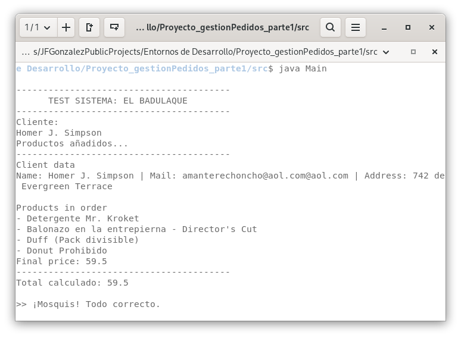

## Proyecto - Sistema de Gestión de Pedidos - Parte 1
Proyecto desarrollado para el módulo de Entornos de Desarrollo. Implementación de un sistema en Java usando POO para gestionar pedidos con productos físicos y digitales. La aplicación permite registrar clientes, crear productos con comportamientos diferenciados (físicos con envío, digitales con descuento) y generar pedidos calculando precios totales.

### Estructura del Proyecto
* **src/**: Código fuente.
* **docs/**: Memoria del proyecto en PDF.
* **diagrams/**: Diagramas UML (.puml, .svg, .png).

### Instrucciones de Ejecución
1. Compilar los archivos desde la carpeta `src`:

   ```bash
   javac *.java
   ```
2. Ejecutar la clase principal:

    ```bash
    java Main
    ```

### Ejecución
